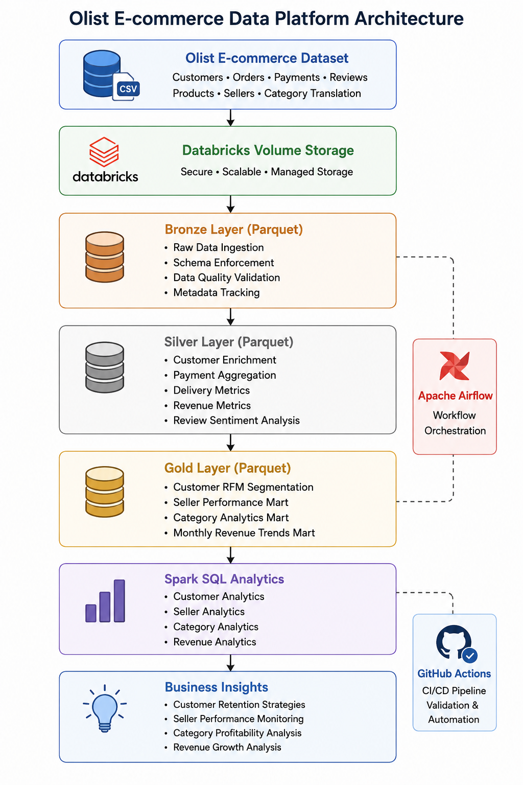
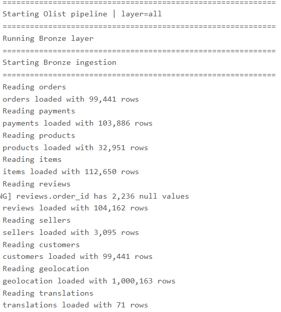
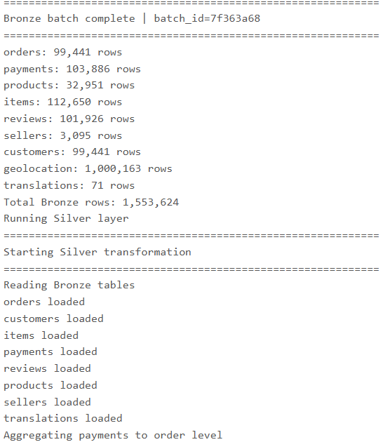
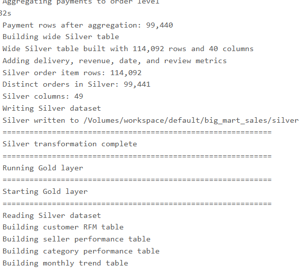
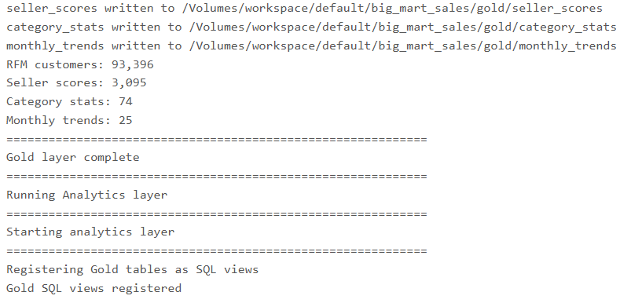
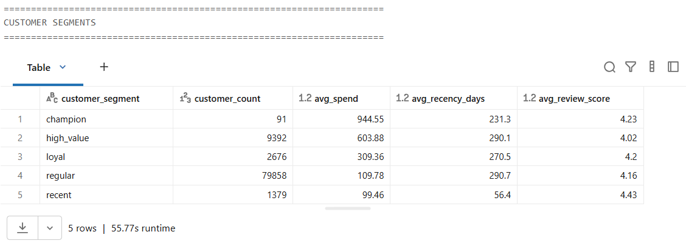

# Olist E-commerce Data Platform on Databricks

## Overview

This project builds an end-to-end Data Engineering platform on Databricks Community Edition using PySpark, Parquet, Spark SQL, Apache Airflow, and GitHub Actions.

The platform ingests raw Olist e-commerce data, performs data quality validation, transforms transactional datasets through a Medallion Architecture (Bronze → Silver → Gold), and generates analytical marts for customer segmentation, seller performance, category analytics, and revenue trend reporting.

---

## Business Problem

E-commerce businesses generate large volumes of data across customers, orders, products, sellers, payments, and reviews.

Business teams need reliable analytics to:

- Identify high-value customers
- Track seller performance
- Analyze category profitability
- Monitor delivery quality
- Understand customer behavior
- Measure revenue growth trends

Raw transactional data is fragmented across multiple tables and difficult to analyze directly. This project transforms operational data into business-ready analytical datasets.

---

## Architecture

The platform follows a Medallion Architecture implemented on Databricks using PySpark, Parquet, Spark SQL, Apache Airflow, and GitHub Actions.

The pipeline ingests raw Olist datasets, transforms them through Bronze, Silver, and Gold layers, and generates business-ready analytical marts for customer, seller, category, and revenue analytics.

---

## Technology Stack

| Layer | Technology |
|---------|------------|
| Platform | Databricks Community Edition |
| Processing | PySpark |
| Storage | Parquet |
| Analytics | Spark SQL |
| Workflow Orchestration | Apache Airflow |
| CI/CD | GitHub Actions |
| Programming Language | Python |
| Architecture | Medallion Architecture |
| Version Control | Git & GitHub |

---

## Dataset

The platform uses the Olist Brazilian E-commerce Dataset.

### Source Tables

- Customers
- Orders
- Order Items
- Payments
- Reviews
- Products
- Sellers
- Product Category Translation

### Dataset Scale

| Metric | Value |
|----------|----------|
| Orders | 99,441 |
| Customers | 99,441 |
| Order Items | 112,650 |
| Payments | 103,886 |
| Reviews | 104,162 |
| Products | 32,951 |
| Sellers | 3,095 |

---

## Pipeline Metrics

| Metric | Value |
|----------|----------|
| Total Bronze Rows | 1,553,624 |
| Silver Rows | 114,092 |
| Silver Columns | 49 |
| Distinct Orders | 99,441 |
| RFM Customers | 93,396 |
| Seller Scores | 3,095 |
| Category Statistics | 74 |
| Monthly Trend Records | 25 |

---

## Bronze Layer

The Bronze layer stores raw source data while preserving source fidelity.

### Features

- Raw data ingestion
- Schema enforcement
- Metadata tracking
- Data quality validation
- Source lineage tracking

---

## Silver Layer

The Silver layer creates a business-ready order-level dataset through enrichment and transformations.

### Business Features

- Customer enrichment
- Seller enrichment
- Product category translation
- Payment aggregation
- Review integration
- Delivery performance metrics

### Derived Metrics

- Delivery Delay Days
- Fulfillment Days
- Total Item Revenue
- Freight Percentage
- Review Sentiment
- Order Year, Month, and Day

---

## Gold Layer

The Gold layer contains analytical marts optimized for reporting and business decision-making.

### Customer RFM Segmentation

Customer groups generated using Recency, Frequency, and Monetary analysis:

- Champions
- High Value
- Loyal
- Regular
- Recent

### Seller Performance Mart

Metrics include:

- Revenue
- Review Scores
- Delivery Performance
- Revenue Rankings

### Category Analytics Mart

Metrics include:

- Revenue by Category
- Order Volume
- Customer Satisfaction
- Average Review Scores

### Monthly Revenue Trends Mart

Metrics include:

- Revenue Growth
- Order Trends
- Customer Trends
- Delivery Performance

---

## Pipeline Execution

### Bronze Layer Execution

Raw datasets ingested into Databricks and stored as Parquet files.

---

### Silver Layer Processing

Business enrichment, joins, delivery metrics, payment aggregation, and sentiment creation.

---

### Gold Layer Analytics

Customer segmentation, seller scoring, category analytics, and revenue trend generation.

---

### Spark SQL Reporting Layer

Business-ready reporting datasets generated from Gold layer outputs.

---

## Analytics Results

### Customer Segmentation

#### Key Insights

- High Value customers spend more than 6× compared to Regular customers.
- Champions contribute a disproportionate share of revenue.
- Recent customers show strong retention potential.

---

### Top 10 Sellers by Revenue

#### Key Insights

- Top-performing sellers are concentrated in São Paulo.
- Leading sellers generate over 200K in revenue.
- Revenue contribution is heavily concentrated among a small group of sellers.

---

### Top 15 Product Categories

#### Highest Revenue Categories

1. Health & Beauty
2. Watches & Gifts
3. Bed Bath & Table
4. Sports & Leisure
5. Computer Accessories

---

### Monthly Revenue Trends

#### Key Insights

- Revenue grows steadily throughout 2017.
- Order volume increases significantly over time.
- Seasonal purchasing patterns are clearly visible.

---

## Workflow Orchestration

Apache Airflow orchestrates the complete pipeline.

Pipeline stages:

1. Bronze Data Ingestion
2. Silver Data Transformation
3. Gold Analytics Generation
4. Spark SQL Reporting

Benefits:

- Automated execution
- Dependency management
- Monitoring and observability
- Production-style workflow orchestration

---

## CI/CD

GitHub Actions provides automated validation for the project.

### Automated Checks

- Python dependency installation
- PySpark validation
- Airflow validation
- Python syntax checks
- Pipeline module verification

Validated files include:

- main.py
- bronze_loader.py
- silver_cleaner.py
- gold_features.py
- analytics.py
- spark_session.py
- config.py
- olist_pipeline_dag.py

---

## Business Value

The platform enables organizations to:

- Identify high-value customers
- Improve retention strategies
- Monitor seller performance
- Track delivery quality
- Analyze category profitability
- Measure revenue growth
- Support data-driven decision-making

---

## Project Outcomes

- Built an end-to-end Data Engineering platform on Databricks.
- Processed over 1.5 million source records.
- Implemented a Medallion Architecture using Bronze, Silver, and Gold layers.
- Created analytical marts for customer, seller, category, and revenue reporting.
- Implemented Apache Airflow workflow orchestration.
- Built Spark SQL reporting datasets.
- Added GitHub Actions CI/CD validation.
- Generated actionable business insights from raw transactional data.

---

## Skills Demonstrated

### Data Engineering

- PySpark
- ETL Development
- Data Ingestion
- Data Validation
- Data Modeling
- Medallion Architecture

### Databricks & Analytics

- Databricks
- Spark SQL
- Parquet Storage
- Customer Segmentation
- Revenue Analytics
- Seller Analytics
- Category Analytics

### DevOps

- Apache Airflow
- GitHub Actions
- CI/CD
- Git & GitHub

---

## Author

**Dharmik Patel**

Portfolio: https://www.ptldharmik.com

GitHub: https://github.com/dharu0908
