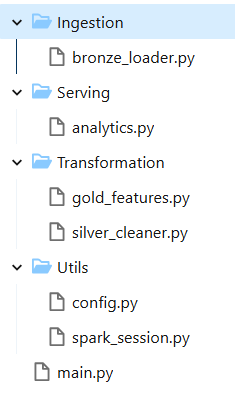

# 🚀 Olist E-commerce Data Platform on Databricks

An end-to-end Data Engineering project built on **Databricks Community Edition** using **PySpark**, **Parquet**, and a **Medallion Architecture (Bronze → Silver → Gold)**.

The platform ingests raw Olist e-commerce data, performs data quality validation, builds analytical datasets, and generates business-focused insights such as customer segmentation, seller performance, product category analytics, and revenue trends.

---

# 📌 Project Overview

This project demonstrates how raw transactional data can be transformed into business-ready analytical datasets.

### Key Capabilities

- Raw CSV ingestion into Bronze layer
- Data quality validation and schema enforcement
- Business-focused Silver transformations
- Gold analytical marts
- Spark SQL reporting layer
- Customer segmentation using RFM analysis
- Seller and category performance analytics

---

# 🏗 Architecture

```text
                        Olist CSV Files
                               │
                               ▼
                    Databricks Volume Storage
                               │
                               ▼
┌──────────────────────────────────────────────┐
│                 Bronze Layer                 │
├──────────────────────────────────────────────┤
│ Raw Parquet Storage                          │
│ Schema Enforcement                           │
│ Metadata Tracking                            │
│ Data Quality Validation                      │
└──────────────────────────────────────────────┘
                               │
                               ▼
┌──────────────────────────────────────────────┐
│                 Silver Layer                 │
├──────────────────────────────────────────────┤
│ Payment Aggregation                          │
│ Customer Enrichment                          │
│ Product Category Translation                 │
│ Delivery Metrics                             │
│ Revenue Metrics                              │
│ Review Sentiment Analysis                    │
└──────────────────────────────────────────────┘
                               │
                               ▼
┌──────────────────────────────────────────────┐
│                  Gold Layer                  │
├──────────────────────────────────────────────┤
│ Customer RFM Segmentation                    │
│ Seller Performance Mart                      │
│ Category Analytics Mart                      │
│ Monthly Revenue Trends Mart                  │
└──────────────────────────────────────────────┘
                               │
                               ▼
                     Spark SQL Analytics
```

---

# 🛠 Tech Stack

| Layer | Technology |
|---------|------------|
| Platform | Databricks Community Edition |
| Processing | PySpark |
| Storage | Parquet |
| Analytics | Spark SQL |
| Language | Python |
| Architecture | Medallion Architecture |
| Dataset | Olist E-commerce Dataset |

---

# 📂 Project Structure



---

# ⚙️ End-to-End Pipeline Execution


### Pipeline Metrics

| Metric | Value |
|----------|----------|
| Total Bronze Rows | 1,553,624 |
| Silver Rows | 114,092 |
| Silver Columns | 49 |
| Distinct Orders | 99,441 |
| RFM Customers | 93,396 |
| Seller Scores | 3,095 |
| Category Stats | 74 |
| Monthly Trend Records | 25 |

---

# 🥉 Bronze Layer

The Bronze layer ingests raw CSV datasets and stores them as Parquet files while preserving source fidelity.

### Features

- Explicit schema enforcement
- Metadata tracking
- Row count validation
- Null key detection
- Source file lineage

---

# 🥈 Silver Layer

The Silver layer creates a business-ready order-level dataset by joining and enriching raw datasets.

### Business Features Created

- Delivery Delay Days
- Fulfillment Days
- Total Item Revenue
- Freight Percentage
- Review Sentiment
- Order Date Dimensions

---

# 🥇 Gold Layer

The Gold layer contains analytical marts optimized for reporting and business decision-making.

### Gold Datasets

#### Customer RFM Mart
- Champion
- High Value
- Loyal
- Regular
- Recent

#### Seller Performance Mart
- Revenue Metrics
- Seller Tiering
- Delivery Performance
- Review Scores

#### Category Analytics Mart
- Revenue by Category
- Order Volume
- Customer Satisfaction

#### Monthly Trends Mart
- Revenue Growth
- Order Volume Trends
- Delivery Performance

---

# 📊 Analytics Results

## Customer Segmentation


### Insights

- High Value customers spend over 6x more than Regular customers.
- Champions represent a small but highly valuable customer group.
- Recent customers show the strongest review scores.

---

## Top 10 Sellers by Revenue


### Insights

- Top-performing sellers are heavily concentrated in São Paulo.
- Top sellers generate more than 200K in revenue.
- Seller performance varies significantly by region.

---

## Top 15 Product Categories


### Insights

Highest-performing categories:

1. Health & Beauty
2. Watches & Gifts
3. Bed Bath & Table
4. Sports & Leisure
5. Computer Accessories

---

## Monthly Revenue Trends


### Insights

- Revenue grows steadily throughout 2017.
- Order volume increases significantly over time.
- Seasonal shopping trends are visible.

---

# 📈 Business Value

This platform enables teams to:

- Identify high-value customers
- Track seller performance
- Monitor delivery quality
- Analyze category profitability
- Understand revenue trends
- Support retention and growth strategies

---

# 🎯 Skills Demonstrated

### Data Engineering

- Data Ingestion
- ETL Development
- Schema Management
- Data Validation
- Data Modeling
- Medallion Architecture

### Databricks

- Databricks Volumes
- PySpark Transformations
- Spark SQL
- Parquet Storage

### Analytics

- Customer Segmentation
- Revenue Analysis
- KPI Development
- Business Reporting

---
<!--
# 🚀 Future Improvements

- Delta Lake implementation
- Incremental processing
- Workflow orchestration
- Data quality framework
- Power BI dashboards
- CI/CD automation
-->

---

## Author

**Dharmik Patel**

Data Engineering | PySpark | Databricks | SQL | Analytics Engineering
